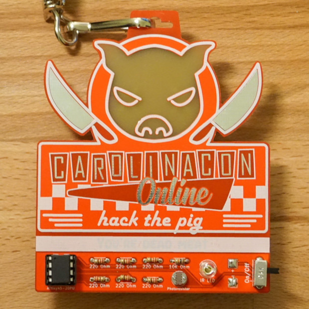

# CarolinaCon Online Badge

This is the official badge for Carolina Con Online in 2021. Carolina Con Online has a North Carolina BBQ theme this year so, our badge does too! We featured the con logo as PCB art and a simple circuit with an ATTINY45 to control 5 LEDs and 1 IR LED.

This badge features 2 LEDs behind the pig eyes that make glowing red X's appear when lit up. We also have a hidden message under the strip of silkscreen above the circuit. When the badge is in a dark room the photoresistor will trigger LEDs behind the silkscreen to reveal a hidden message!

~~The badge + a shirt can be purchased here for just $25: [https://www.ebay.com/itm/313466298666](https://www.ebay.com/itm/313466298666)~~

The badge is no longer for sale now that CarolinaCon Online has ended. Thank you to everyone who ordered one!

CarolinaCon is a volunteer run hacker con based in NC that is online this year happening from 4/23/21 to 4/25/21

* We've got talks!
* We've got a CTF where the top 3 winners get NC BBQ sauce as a prize!
* We've got merch!

[https://carolinacon.org](https://carolinacon.org)